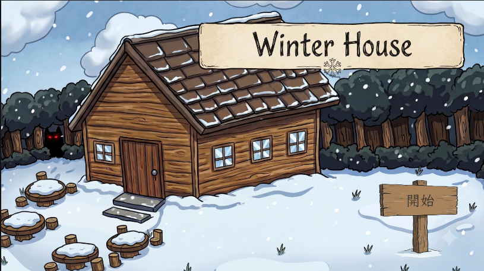
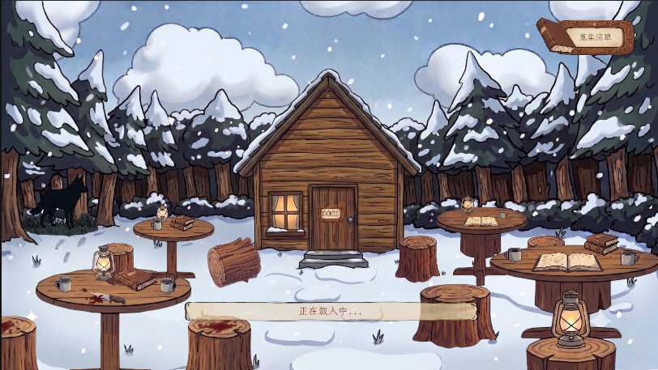
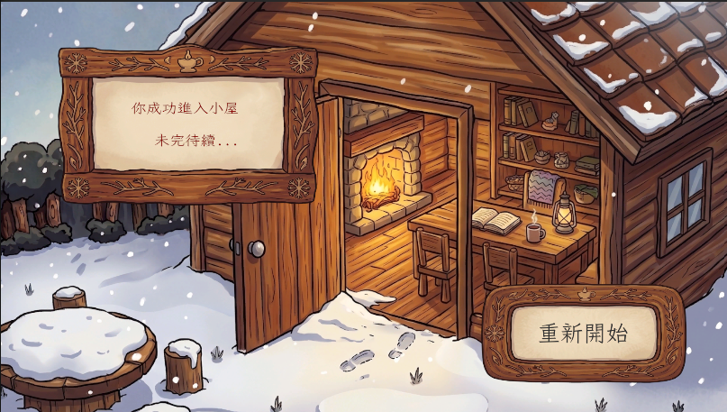

# 歡迎來到 Winter House：2D單人解謎遊戲開發指南 📖

記錄以 Unity 開發的密室解謎遊戲《Winter House》的製作心得分享網站。
開發2D單人遊戲設備不需頂規，五年前的文書機(~~雖然有加裝16GB的RAM~~)都可以開發，並且開發可以從頭到尾都使用AI引導開發，零壓力上陣，快速開發屬於自己的小遊戲。

## 📌 網站導覽指南

本網站記錄了這款遊戲背後的開發血淚與技術解法：

* 👈 **側邊導覽列**：請點擊左側目錄，選擇你想閱讀的開發章節。
* 🔍 **快速搜尋**：右上角的搜尋框可以幫助你快速找到特定的程式碼或除錯關鍵字。

---

## 🕵️‍♂️ 遊戲劇情簡介

一場看似平靜的讀書會，卻在隔日清晨成為了一樁離奇的命案現場。

死者倒在血泊中，四周散落著幾本翻開的**書籍**、一盞光線微弱的**露營燈**、一把看似防身用的**刀子**，以及桌上六個毫無異狀的**馬克杯**——他到死都不知道，致命的毒藥其實就藏在杯底。

在《Winter House》中，玩家將扮演負責探勘現場的。你必須穿梭在不同的空間中，透過細心觀察與互動，收集關鍵證物，並從每一段隱晦的台詞中，逐步拼湊出隱藏在文字與道具背後的驚悚真相。

---

## 🎮 核心遊戲機制

本作採用經典的「點擊解謎 (Point-and-Click)」玩法，並透過以下核心機制驅動玩家的調查過程：

* **獨立場景探索：** 遊戲分為多個獨立的調查區域（如起始畫面、案發現場、戶外場景等）。每次玩家不幸死亡或點擊重新開始時，場景與搜查進度將會完全重置，確保每一輪都是乾淨、無 Bug 的全新推理體驗。
* **實體道具點擊感應：** 場景中的每一個證物（皆透過 AI 生成並完美去背處理）都搭載了實體碰撞體（Box Collider）。玩家只需使用滑鼠點擊道具，即可觸發調查動作。
* **跨 UI 證物收集系統：** 當玩家發現並點擊關鍵道具後，系統底層的 `GameManager` (大總管) 會自動將其登錄至證物清單，並即時更新畫面上的圖鑑數量（利用 TextMeshPro 呈現），讓玩家隨時掌握目前的搜查進度。
* **沉浸式對話線索：** 點擊道具後，畫面會彈出專屬的對話面板（Panel），給予玩家關鍵的文字敘述與線索。玩家必須根據這些蛛絲馬跡，推理出真正的兇手與犯案手法。

---
準備好踏入命案現場，並窺探遊戲底層的程式碼了嗎？點擊左側的**第零章：AI 輔助素材生成與前置處理流**，我們從 AI 素材煉金術開始！
