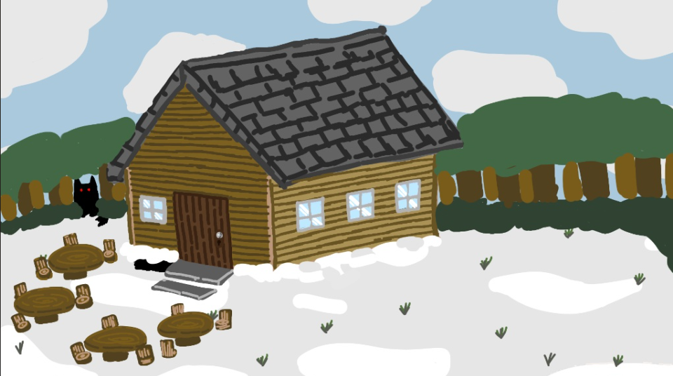
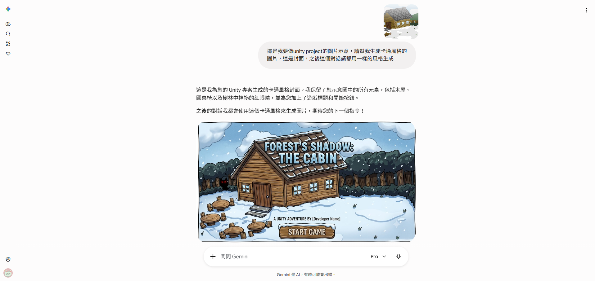
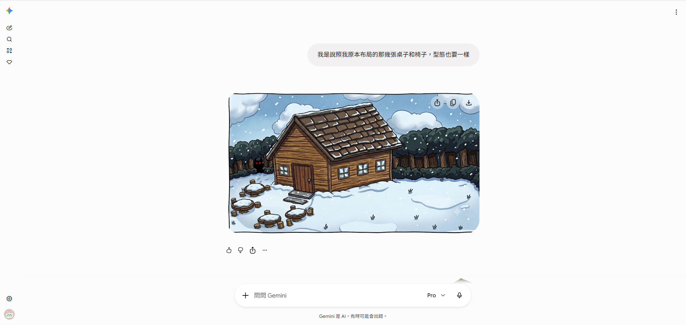
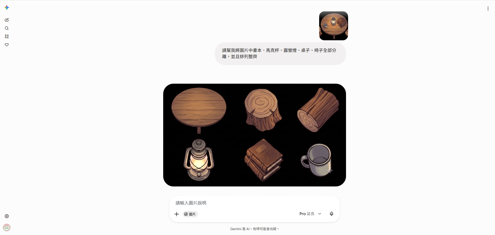
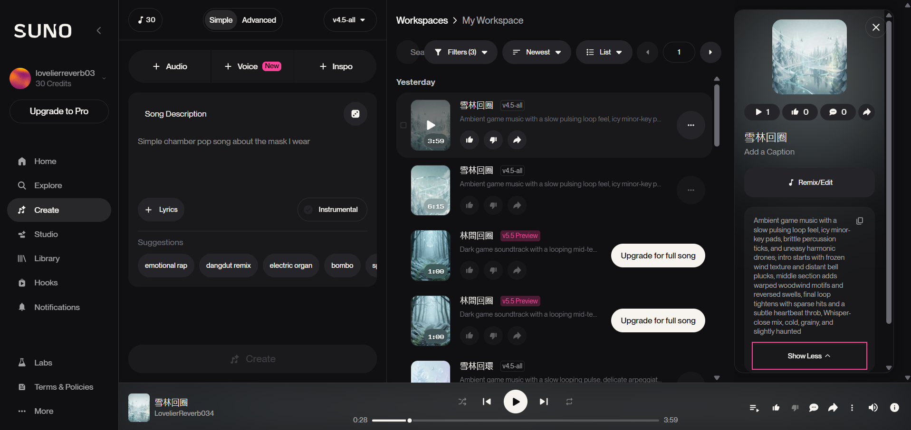

# 第零章：AI 輔助素材生成與前置處理流

開發獨立遊戲時，美術往往是最大的罩門。傳統的資料夾分類就不多贅述了（記得把腳本、圖片、場景分開就好）。這章我們直接進入現代獨立開發者必備的實戰秘笈：**如何利用 AI 工具，快速無痛地產出高品質的遊戲互動素材！**

這次《Winter House》的實體道具（馬克杯、書本、刀子、露營燈），都是透過這套「素材煉金術」打造出來的：

## 🤖 第一步：召喚素材（AI 圖像生成）

與其在素材網上海底撈針，或者打開小畫家從零開始，不如直接請 AI 幫忙。
你可以使用熟悉的 AI 算圖工具，輸入精準的提示詞（Prompt），例如：「寫實風格的復古露營燈」、「一本破舊的精裝書，平放角度」。AI 可以在幾十秒內給你多種高品質的風格選擇，這能省下極大量的初期美術成本。

這次的專案我使用Gemini進行全程的素材生成，在開始生成之前，為了能夠達到喜歡的效果，我還是小小建議一下自己先畫個封面，或是把其他場景的大致布局都先用手繪做一下(~~如果標準很高的話啦~~)，這樣生出來的圖片會更加精確。

**原本是像以下**

~~**跟AI討價還價**~~

然後跟AI討論的過程需要的只有耐心和語言表達能力，所以不需要太擔心，只要訴求說得足夠清楚就可以生出想要的圖片。

## ✂️ 第二步：元素分離（從大圖中挖出寶物）

AI 算圖雖然強大，但它通常會給你「一整張帶有背景的精美情境圖」，而我們在 Unity 裡需要的是「獨立的道具」。

因此，拿到 AI 圖片後，我們必須進行**元素分離**，不過呢，這件事現在的AI也完全可以做到，比如說Gemini就可以直接將生成的圖丟回去給他：

或是網路上也有其他AI元素分離器，查詢 Layer Decomposer 就會出現很多網站，其中我也有是用過一個還可以的：

 - https://komiko.app/zh-TW/layer_splitter

(無奈他的點數時在消耗太快，所以最後還是使用 Gemini 教育帳號拯救我。)

## 🪄 第三步：一鍵去背（轉換為透明 PNG）

這是最關鍵的一步！在 Unity 裡，如果圖片帶有背景，放進場景就會出現一塊醜醜的底色方塊。為了讓道具能自然地擺放在任何場景中，我們必須確保素材是**背景透明的 `.png` 檔案**。

* **去背神器推薦：** 現在完全不需要用 Photoshop 的鋼筆工具慢慢「摳圖」了！網路上有非常多好用的 AI 一鍵去背網站（例如 `remove.bg`、`Photoroom`，或是 Mac 內建的去背功能）。

  - https://www.photoroom.com/tools/background-remover

   

(這真的超級好用，免登入，雖然會一直叫你驗證機器人就是了)

* **操作方式：** 只要把你剛剛分離出來的道具圖片丟進去，系統就會瞬間幫你把邊緣處理得乾乾淨淨，直接下載完美的透明 PNG 檔即可！

## ⚙️ 第四步：匯入 Unity 的防呆設定

當你把完美去背的 PNG 檔案拖進 Unity 的資料夾後，請務必養成這個反射動作：

1. 點擊該圖片。
2. 在右側的 `Inspector` 面板中，找到 **`Texture Type`**。
3. 將它從預設的 `Default` 展開，改成 **`Sprite (2D and UI)`**。
4. 滑到最下面按下 **`Apply`**。

完成這個設定後，這個 AI 生成的精美圖檔，就正式變成 Unity 認可的遊戲圖層，準備好隨時加上 Box Collider 與玩家互動了，視覺美術到現在已經基本完成。

## 🎵 第五步：喚醒氛圍（AI 音樂與音效生成）

一個安靜的密室是沒有靈魂的。除了視覺道具，我們同樣可以利用強大的生成式 AI 來打造《午夜讀書會》那種令人毛骨悚然、又帶著懸疑解謎氛圍的背景音樂（BGM），而不需要花大錢去買版權音樂。

(不過如果要商用的話還是需要付費購買版權喔！)

### 1. 選擇強大的 AI 聲音引擎
目前市面上有非常多專門處理音樂生成的 AI 平台，最推薦使用 **Suno** 或是 **Udio** 這類高質量的生成工具。它們對於樂器編制、氛圍塑造的理解非常深，甚至能完美駕馭無人聲的純配樂。如果你需要的是更動態、專注於環境白噪音或沉浸式氛圍的底層鋪墊，也有其他專注於功能性音訊的 AI 工具可以輔助，而這次我使用生成背景音樂的工具是Suno：

- Suno：https://suno.com/create

### 2. 下達精準的「音樂提示詞」(Prompt)
AI 音樂跟畫圖一樣，需要精準的詠唱技巧。在生成遊戲 BGM 時，請掌握以下關鍵字：
* **必加關鍵字：** `Instrumental` (純樂器無人聲)、`Loopable` (可無縫輪播)、`Cinematic` (電影感)、`Ambient` (環境音)。
* **情境描述：** 針對《午夜讀書會》，你可以輸入：`Suspenseful escape room background music, dark ambient, ticking clock sound, piano and strings, eerie atmosphere, instrumental.` (懸疑的密室逃脫背景樂，黑暗環境音，時鐘滴答聲，鋼琴與弦樂，詭異氛圍，純樂器)。
* **多方嘗試：** 生成後通常會給出幾種不同風格的版本，請挑選節奏最不會干擾玩家思考的作為主軸。

這樣一來，當玩家進入《Winter House》的場景時，AI 量身打造的懸疑音樂就會無縫循環播放，把玩家徹底拉進命案現場的詭譎氣氛中！
