# 第一章：打造 Start 場景與 UI 中文方塊字救星

歡迎來到《Winter House》的實戰開發階段！作為玩家進入遊戲的第一印象，Start 場景（開始畫面）通常不需要複雜的 3D 模型與物理運算，而是由精美的 **2D 圖片與 UI (使用者介面)** 所組成。

但在建立按鈕的過程中，我們將會遇到 Unity 新手村最經典的「中文字變方塊」Bug，這章將教你如何用最有效率的方式徹底根除它！

---

## 🎬 第一步：建立 Start_Scene 與 UI 畫布 (Canvas)

首先，我們要把舞台搭建起來，長得像下面這樣。

1. 在 `Project` 視窗的 `_Scenes` 資料夾中，點擊右鍵 ➔ `Create` ➔ `Scene`，命名為 **`Start_Scene`** 並雙擊打開它。
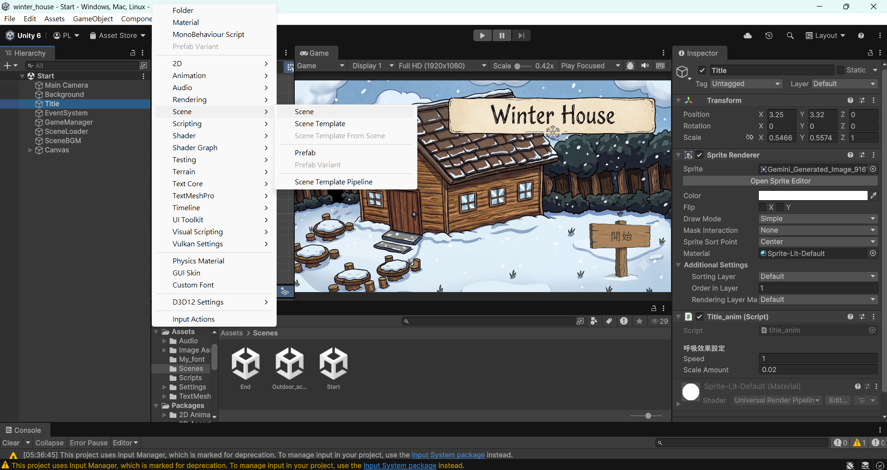

2. 在左側的 `Hierarchy` (階層) 視窗空白處，點擊右鍵 ➔ `UI` ➔ **`Canvas` (畫布)**。
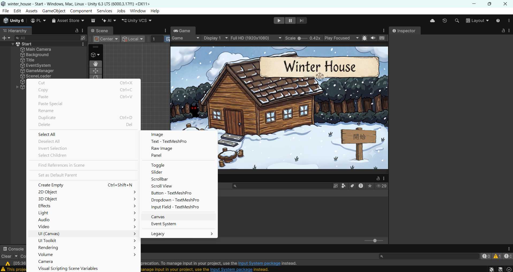

3. Unity 會自動幫你生成一個 `Canvas` 以及一個負責處理滑鼠點擊的 `EventSystem`（千萬別刪掉它，不然按鈕會全部失效！）。
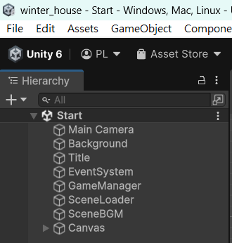

> **💡 畫布是什麼？** 
> Canvas 就像是貼在玩家螢幕玻璃上的一層透明塑膠片，所有的 2D 圖片、按鈕、對話框都必須放在 Canvas 底下，才不會跟 3D 遊戲世界混在一起。

---

## 🖼️ 第二步：匯入 2D 背景與標題圖片

還記得我們在「第零章」用 AI 生成並去背好的圖片嗎？現在要把它們掛到畫布上了。

1. 確認你的圖片已經拉進 Unity，並且在右側 Inspector 面板中，`Texture Type` 已經設為 **`Sprite (2D and UI)`**。
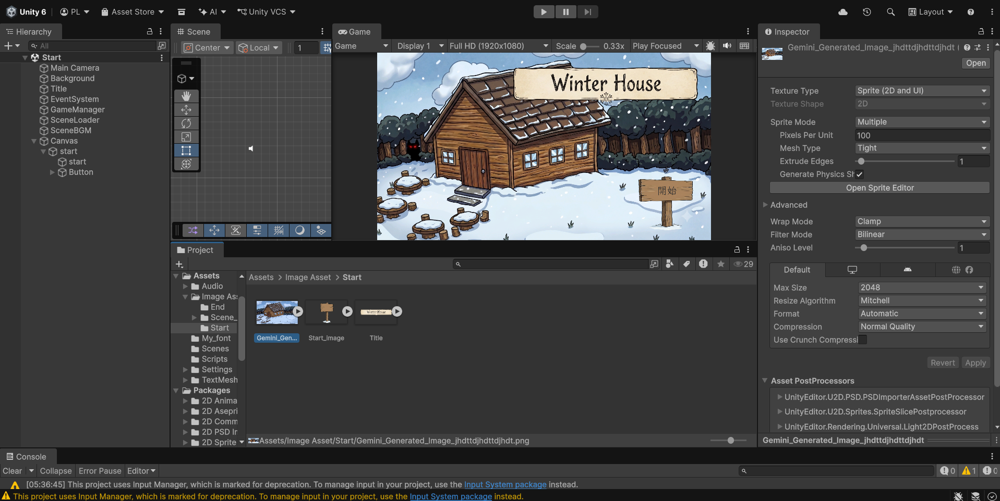

2. 直接在 `Hierarchy` 拖入要當背景的圖片，將這個新生成的物件命名為 `Background`。
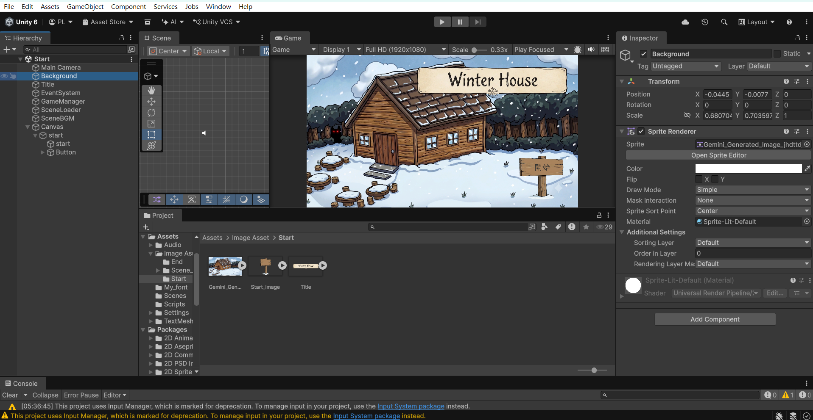

3. 重複以上步驟，再建立遊戲標題（Logo）。你可以透過拖曳邊框或調整 `Rect Transform` 來決定它們在畫面上的大小與位置。
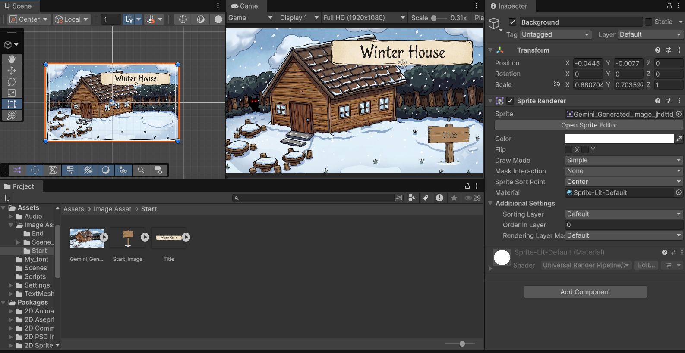

---

## 🚨 第三步：建立開始按鈕與「方塊字大魔王」的誕生

接下來，我們需要一個「開始遊戲」的按鈕。

1. 在 `Canvas` 上按右鍵 ➔ `UI` ➔ **`Button - TextMeshPro`**。
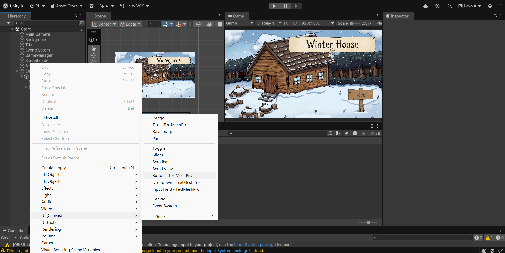

2. 展開這個 Button，你會看到底下有一個 `Text (TMP)` 物件。
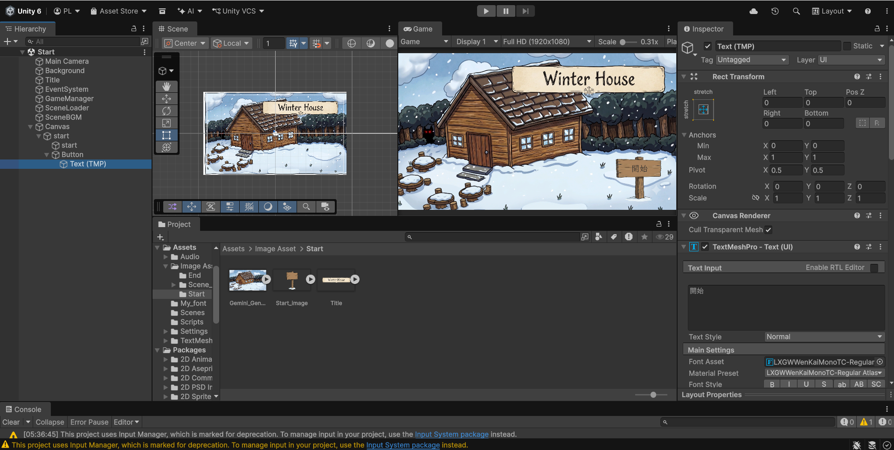

3. 點選這個文字物件，在右側的文字框裡輸入：**「開始遊戲」**。
**💥 慘劇發生：** 你的畫面上不但沒有出現「開始遊戲」，反而出現了四個打叉的方塊 `[X] [X] [X] [X]`！
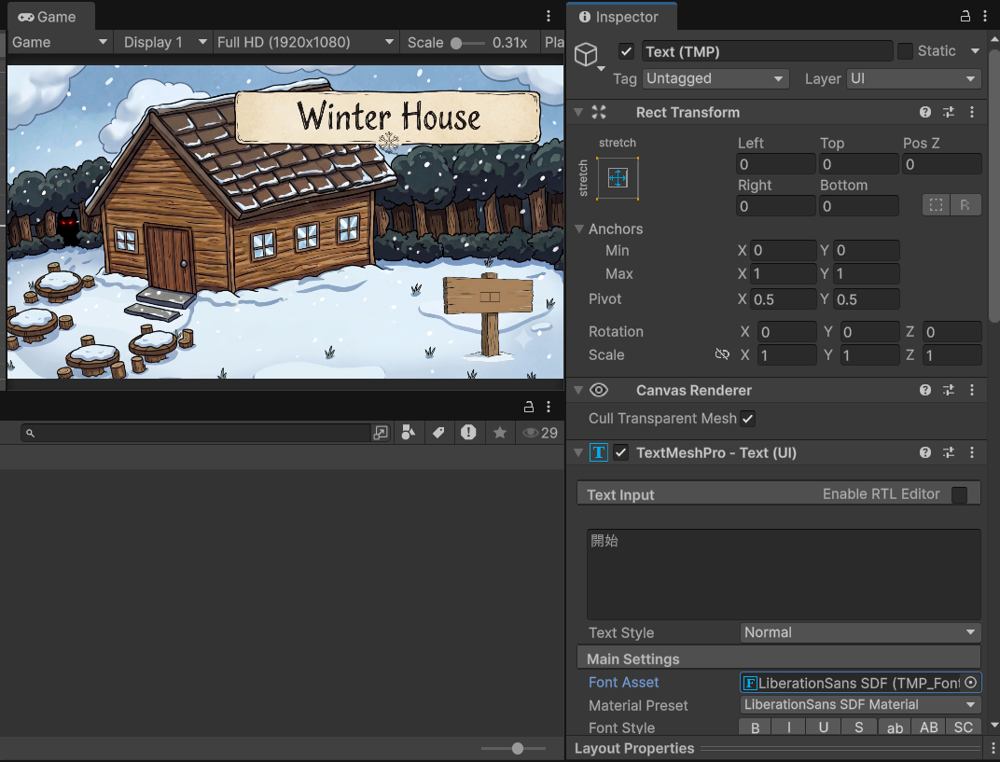

這是因為 Unity 目前的主流文字系統 TextMeshPro (TMP) 預設只包含英文字母。當它遇到博大精深的繁體中文時，它讀不懂，就只能給你方塊了。

---

## 🦸‍♂️ 第四步：動態字體 (Dynamic) 終極救星

過去的傳統教學，會叫你打開 `Font Asset Creator`，然後花好幾分鐘把幾萬個中文字「烘焙 (Bake)」成一張巨大的圖片。這不但超浪費容量，萬一漏掉一個字，還是會變方塊。

現在，我們使用更現代、效能更好的**「動態字體 (Dynamic)」**設定法，一勞永逸解決這個問題：

### 1. 準備中文字型檔
找一個你喜歡的開源中文字型（例如 Google 的 `Noto Sans TC`，檔案格式通常是 `.ttf` 或 `.otf`），把它拖曳進 Unity 專案的資料夾裡。
- 可以直接上去Google Font上面找： https://fonts.google.com/
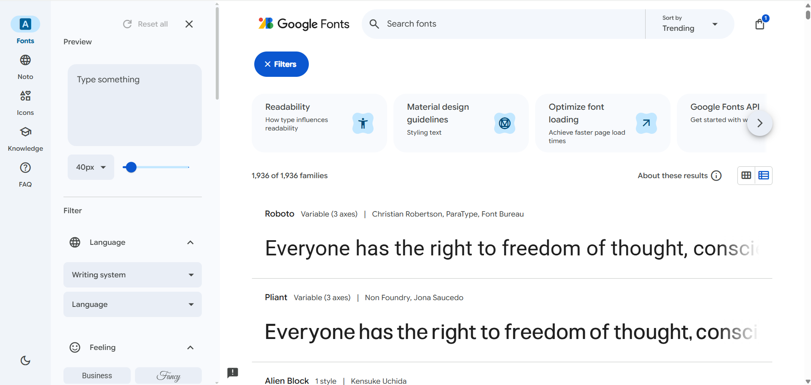

### 2. 生成 TMP 字型資產
對著這個字型檔點擊右鍵 ➔ `Create` ➔ `TextMeshPro` ➔ **`Font Asset`**。
你會看到旁邊多出一個帶有藍色圖示的新檔案。
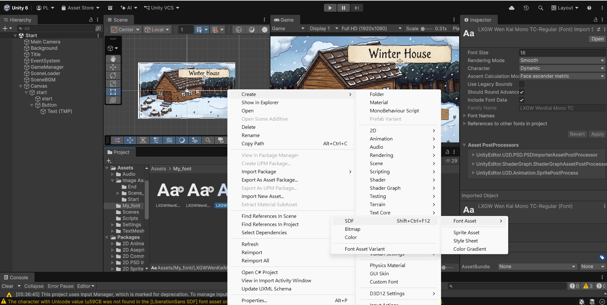

### 3. 開啟「動態 (Dynamic)」魔法 🌟
點擊剛剛生成的藍色字型資產，看向右側的 `Inspector` 面板：
1. 找到 **`Generation Settings`** 區塊並展開。
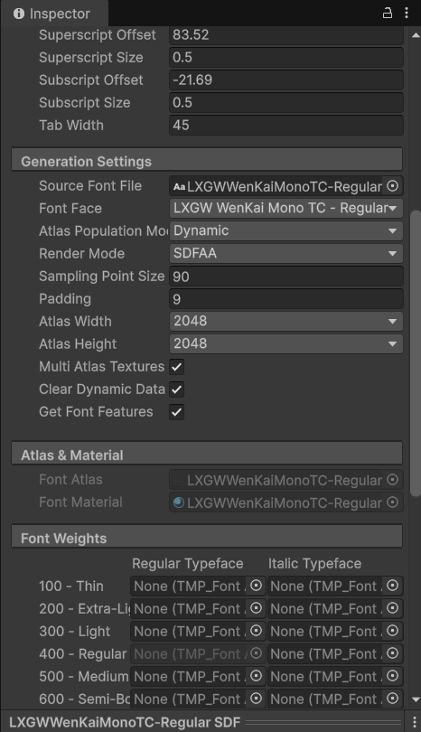

2. 找到 **`Atlas Population Mode`** 這個選項，將它從預設的 `Static` (靜態) 改為 **`Dynamic` (動態)**
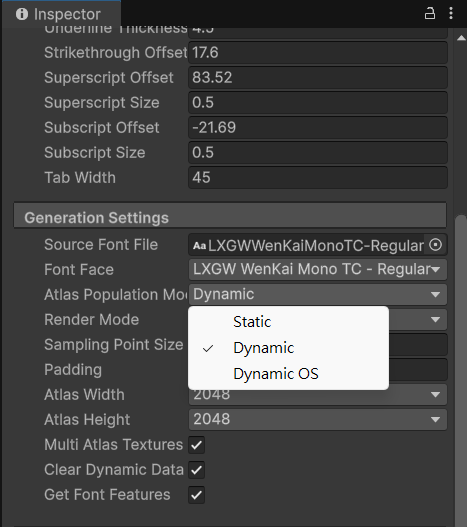

3. 點擊右上角或滑到最下面按下 **`Apply`** 儲存設定。

### 4. 套用字型，方塊退散！
回到你剛剛那個出現方塊字的 Button 底下的 `Text (TMP)` 物件。
在右側 `TextMeshPro - Text (UI)` 元件裡，找到 **`Font Asset`** 欄位，把你剛剛設定好的動態字型拖曳進去。
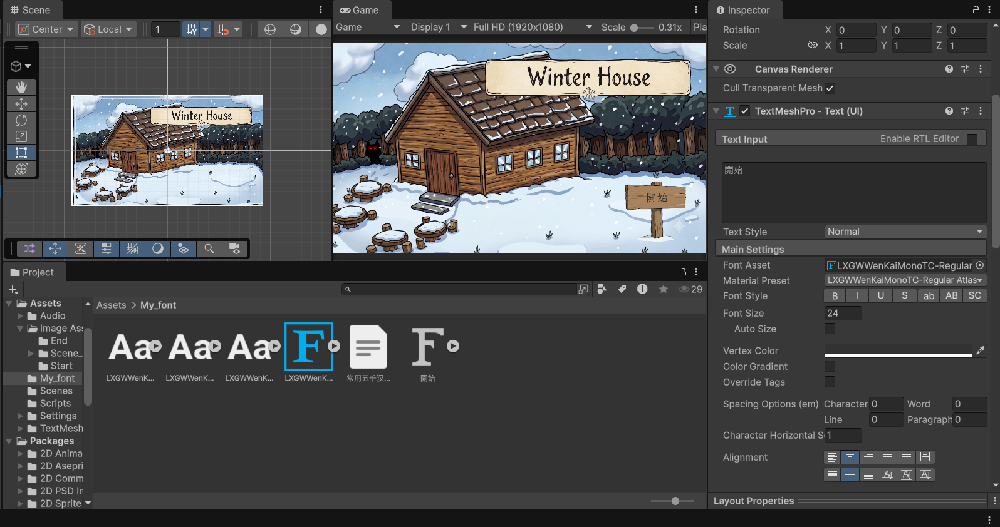

**✨ 奇蹟發生：** 畫面上的方塊瞬間變成了漂漂亮亮的「開始遊戲」四個大字！

> **🎯 為什麼 Dynamic 這麼強？**
> 開啟動態模式後，Unity 不會傻傻地把幾萬個中文字塞進遊戲裡。而是「玩家畫面上出現什麼字，系統才臨時去字型庫裡把那個字抓出來顯示」。這對需要大量文本與對話框的《Winter House》來說，絕對是節省效能與容量的終極必殺技，接下來我們就要進入**第二章**設定整個主要遊玩畫面。
