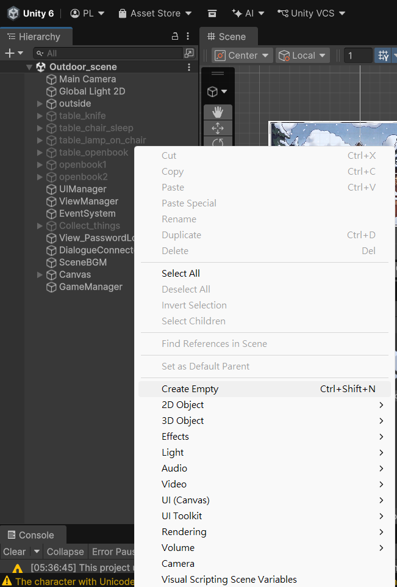
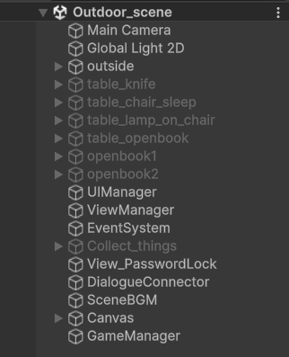
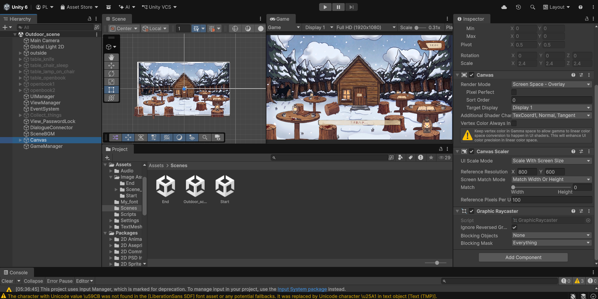
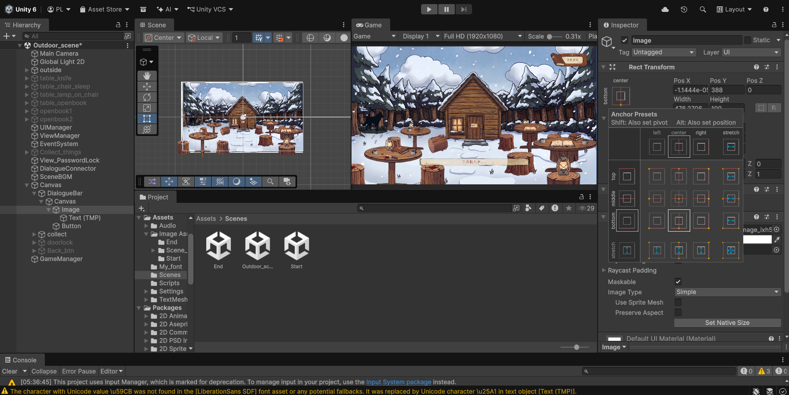
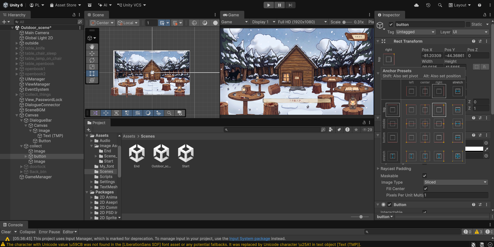

# 第二章：佈局 Play 場景與破解「UI 跑版地獄」

離開了單純的開始畫面，我們正式進入《Winter House》的核心——Play 場景（遊玩場景）。這裡將會是所有命案線索、可互動道具與對話框交匯的地方。

這章我們有兩大任務：第一，建立一個「絕對不會迷路」的物件分類系統；第二，徹底解決 Unity 新手最常崩潰的「UI 跑版」問題。

---

## 🗂️ 第一步：用「空物件」打造完美分類資料夾

在複雜的 Play 場景中，如果你把所有的燈光、桌子、馬克杯、UI 畫布全塞在同一層，幾天後你絕對找不到你要修改的東西。

在 Unity 裡，最專業的做法是利用 **Empty GameObject (空物件)** 來建立自己熟悉的層級：

1. 在左側 `Hierarchy` 視窗空白處點擊右鍵 ➔ **`Create Empty`**。

2. 可以將不同素材拖入空物件底下先進行分類，依照場景中不同遠景和近景去排列。

完成後，請把你拉進場景的物件，分別用滑鼠「拖曳」進這些對應的空物件底下。這樣你的場景結構就會瞬間變得像教科書一樣乾淨整齊！

---

## 🚨 第二步：為什麼 UI 會跑版？

接下來我們要在 `UI_Canvas` 的分類底下建立遊戲最重要的介面：**對話框面板 (Panel)** 以及右上角的 **圖鑑圖示 (Image)**。

**💥 慘劇發生：** 當你在 Unity 編輯器裡排得漂漂亮亮，一旦打包成 `.exe` 或切換螢幕解析度時，你會發現對話框變超小，或者背包圖示直接飛出螢幕邊緣！

這是因為 Unity 的 Canvas 預設是以「絕對像素 (Constant Pixel Size)」來計算的。如果你的對話框寬度是 800 像素，在 1080p 螢幕上看剛好，但在 4K 螢幕上就會縮水成一小塊。

---

## 🛡️ 第三步：Canvas Scaler (完美縮放術)

要破解這個地獄，只需要三個神級設定。請點擊你場景中的 **`Canvas`**，然後看向右側的 `Inspector` 面板，找到 **`Canvas Scaler`** 這個元件：

1. **更改縮放模式：** 將 `UI Scale Mode` 從預設的 `Constant Pixel Size` 改為 **`Scale With Screen Size`** (跟隨螢幕大小縮放)。

2. **設定基準解析度：** 在 `Reference Resolution` 輸入你開發時的畫面大小。

只要做好這三步，你的 UI 就獲得了「適應各種螢幕大小」的超能力，無論玩家用什麼螢幕玩《Winter House》，畫面比例都會跟你開發時一模一樣！

---

## ⚓ 第四步：UI 錨點 (Anchor) 終極定位法

光能縮放還不夠，我們還要告訴 UI「你應該乖乖待在畫面的哪裡」。這就要靠**錨點 (Anchor)** 來決定。

以「對話框」和「圖鑑圖示」為例：

### 📌 釘死底部：對話框面板 (Dialogue Panel)
1. 點選你的對話框物件。
2. 點擊 `Inspector` 裡 `Rect Transform` 最左上角的那個「方形準星」圖示。
3. 按住鍵盤上的 **`Shift` + `Alt`** 鍵不放（Mac 請按 `Shift` + `Option`）。
4. 點選九宮格中最下方、正中間的那個圖示（Bottom Center）。
   *(這代表對話框永遠會緊緊貼著螢幕正下方，不會往上飄。)*

### 📌 釘死右上角：圖鑑按鈕 (Inventory Icon)
1. 點選你的背包按鈕物件。
2. 同樣打開錨點九宮格，按住 **`Shift` + `Alt`**。
3. 點選最右上角的圖示（Top Right）。
   *(這樣一來，不論螢幕多寬，它永遠會釘死在右上角，不會跑到畫面中間！)*

完成了場景分類與防跑版設定後，你的 Play 場景現在已經有了一個最穩固的地基。準備好迎接下一章了嗎？
