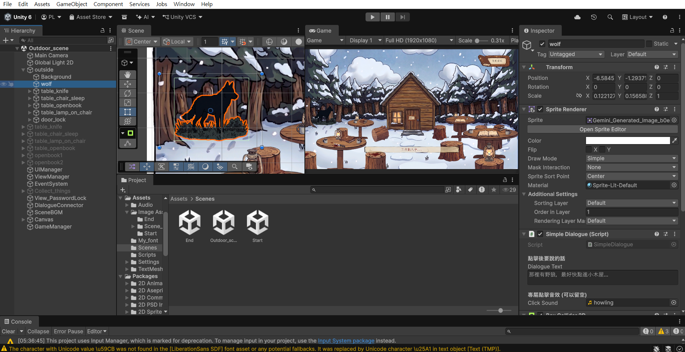
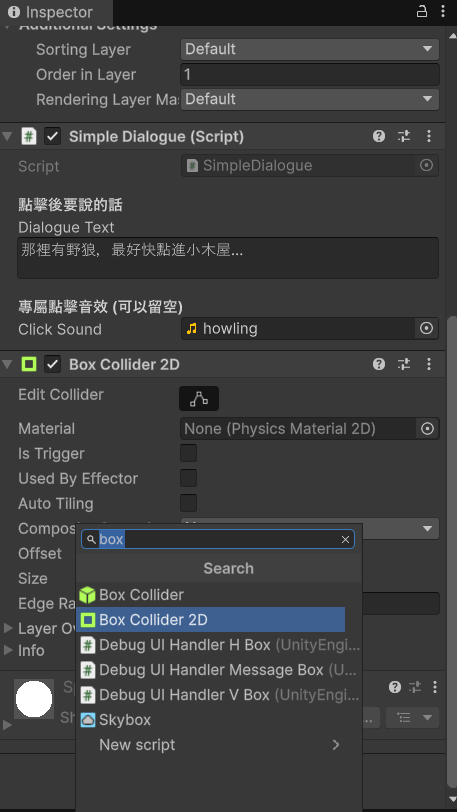
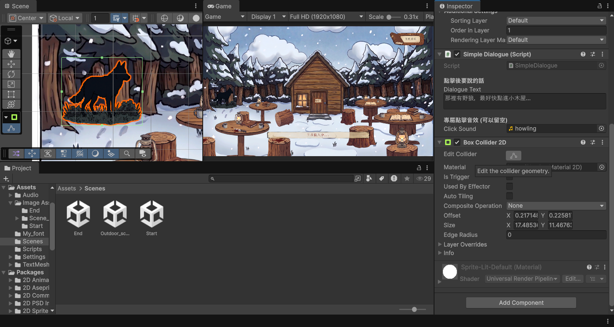

# 第五章：實體道具互動！Box Collider 與對話框的完美串接

在第二章我們把 Play 場景的對話框與 UI 排版固定好了；現在，我們要讓場景中的實體道具（例如那把刀子、馬克杯）擁有被點擊的能力，並且能在點擊後，呼叫大總管 `GameManager` 彈出對話框。

這是一個經典的「點擊解謎 (Point-and-Click)」互動迴圈！

---

## 🛡️ 第一步：確保道具有「物理防護罩」

在 Unity 中，滑鼠是點不到一張「純圖片」的，它只能點擊到「碰撞體 (Collider)」。

1. 點選包含圖片的資料夾底下的道具（例如 `Mug` 馬克杯）。


2. 在右側 `Inspector` 點擊 `Add Component`，加入 **`Box Collider 2D`**（如果是 3D 專案請選 `Box Collider`）。


3. 點擊 `Edit Collider` 的小圖示，調整綠色框框，讓它完美包覆住馬克杯。
   *(這塊綠色區域，就是未來玩家滑鼠可以點擊的感應區！)*


---

## 📜 第二步：撰寫道具專屬腳本 (InteractableItem)

接下來，我們要給這個馬克杯大腦，讓它知道「被點擊時要說什麼話」。

1. 在 `Scripts` 資料夾建立新 C# 腳本，命名為 **`SimpleDialogue`**。
2. 將腳本拖曳掛載到馬克杯上。
3. 雙擊打開腳本，寫入以下程式碼：

```csharp
using UnityEngine;

public class SimpleDialogue : MonoBehaviour
{
    [Header("點擊後要說的話")]
    [TextArea(2, 5)]
    public string dialogueText = "這是一段測試文字...";

    // ★ 就是漏了這行！現在加上去了
    [Header("專屬點擊音效 (可以留空)")]
    public AudioClip clickSound; 

    private Collider2D myCollider;

    private void Start()
    {
        // 自動抓取自己身上的碰撞器
        myCollider = GetComponent<Collider2D>();
    }

    private void Update()
    {
        // 1. 偵測玩家有沒有按下 mouse 左鍵
        if (Input.GetMouseButtonDown(0))
        {
            if (Camera.main == null) return;

            // 2. 轉換滑鼠座標
            Vector2 mouseWorldPos = Camera.main.ScreenToWorldPoint(Input.mousePosition);

            // 3. 數學判定：有點在框框內就觸發
            if (myCollider != null && myCollider.OverlapPoint(mouseWorldPos))
            {
                TriggerDialogue();
            }
        }
    }

    private void TriggerDialogue()
    {
        if (GameManager.Instance != null)
        {
            // 第一步：呼叫大總管彈出對話框
            GameManager.Instance.ShowDialogue(dialogueText);
            
            // 第二步：如果這個物品有專屬音效，呼叫大總管播出來！
            if (clickSound != null)
            {
                GameManager.Instance.PlaySFX(clickSound);
            }
        }
        else
        {
            Debug.LogWarning("找不到大總管 (GameManager)！對話框無法顯示。");
        }
    }
}
