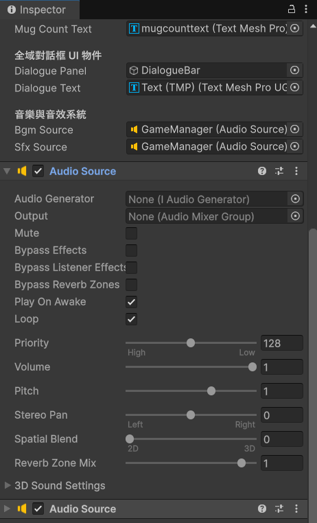
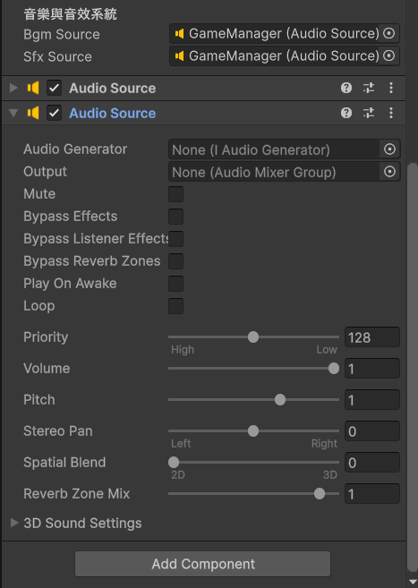

# 第六章：喚醒聽覺！背景音樂與互動音效實裝

在《Winter House》中，呼嘯的寒風與道具碰撞的清脆聲響，是建立「密室逃脫沉浸感」的兩大支柱。我們在第零章已經準備好了音檔，現在要把這些 `.mp3` 和 `.wav` 真正掛載到 Unity 的場景中。

這一章，我們將處理持續播放的「背景音樂 (BGM)」，以及點擊道具時觸發的「互動音效 (SFX)」。

---

## 🎵 第一步：設置環境背景音樂 (BGM)

背景音樂最簡單，它只需要一個喇叭，並且在遊戲開始時自動、無縫地重複播放即可；音效則需要確定只有點擊時才會響起，所以需要另外設定觸發。

1. 在 `Play_Scene` 場景左側的 `Hierarchy` 中，點選你的 `GameManager`物件。

2. 在右側 `Inspector` 點擊 `Add Component`，加入兩個 **`Audio Source`**（這是 Unity 的虛擬喇叭，一個放置背景音樂，一個放置）。

3. **背景音樂關鍵設定：**
   * **`AudioClip`**：把你準備好的背景音樂檔（例如 `Winter_BGM.mp3`）拖曳到這個欄位裡。
   * **`Play On Awake`**：確認有**勾選**（遊戲一執行就會自動播放）。
   * **`Loop`**：務必**勾選**！（這樣音樂播完才會自動從頭開始，達成無縫循環）。


4. **點擊音效關鍵設定：**
   * **`AudioClip`**：把你準備好的音效檔（例如 `ClickSound.mp3`）拖曳到這個欄位裡。
   * **`Play On Awake`**：確認**沒有勾選**（遊戲一執行就會自動播放）。
   * **`Loop`**：務必**不要勾選**！（這樣音效才不會一直）。


---

## 🔊 第二步：利用 GameManager 打造「音效播放中心」

對於短暫的音效（例如點擊馬克杯的「喀啦」聲），如果我們在每個道具上都裝一個喇叭，會非常浪費效能，而且很難統一管理音量。

最聰明的做法，是讓大總管 `GameManager` 兼任「音效播放中心」。只要道具被點擊，就把音效檔傳給大總管，請它代為播放！

請打開你的 **`GameManager`** 腳本，加入兩行關於音效的新程式碼（標示為 `// 新增` 的部分）：

```csharp
using UnityEngine;
using TMPro; 

public class GameManager : MonoBehaviour
{
    public static GameManager Instance;

    //======中間略=====//   
    // ====== ★ 全新功能：音樂與音效系統的喇叭插槽 ======
    [Header("音樂與音效系統")]
    public AudioSource bgmSource; // 負責背景音樂的喇叭 (會循環播放)
    public AudioSource sfxSource; // 負責音效的喇叭 (放點擊聲、過關聲)
    // ================================================
    
    // ====== ★ 全新功能：供全遊戲物件呼叫的「播放音效」功能 ======
    public void PlaySFX(AudioClip clip)
    {
        // 防呆機制：確認音效喇叭和音訊檔案都存在，才執行播放
        if (sfxSource != null && clip != null)
        {
            // 使用 PlayOneShot 可以讓多個音效同時重疊播放，不會互相切斷
            sfxSource.PlayOneShot(clip);
        }
    }
    

    // ====== ★ 新增功能：切換背景音樂 ======
    public void PlayBGM(AudioClip newBGM)
    {
        if (bgmSource != null && newBGM != null)
        {
            // 防呆：如果現在已經在播這首歌，就繼續播，不要重頭開始
            if (bgmSource.clip == newBGM) return;

            bgmSource.clip = newBGM; // 換上新的錄音帶
            bgmSource.Play();        // 開始播放
        }
    }
    // ==========================================================
}
