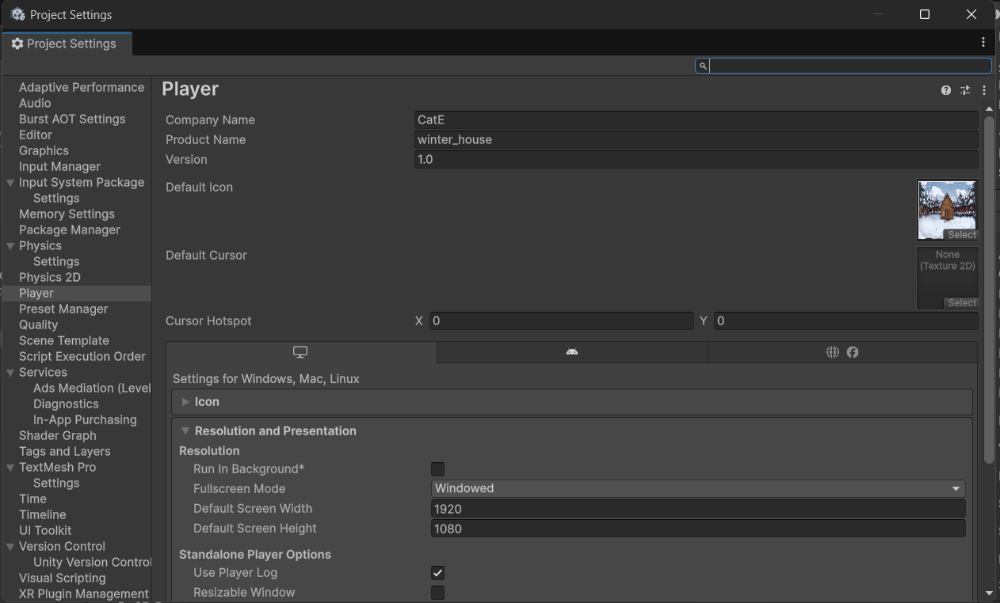

# 第七章：Windows 遊戲出廠 SOP 與防呆檢查

當《Winter House》的命案謎團與對話邏輯都打磨完畢後，就到了最令人興奮的「收成」時刻了！

打包成 Windows `.exe` 執行檔看似簡單，但其實隱藏著許多讓新手翻車的陷阱（例如：傳給朋友卻無法開啟、視窗大小不受控制、遊戲圖示還是預設的 Unity Logo）。只要跟著這套出廠 SOP，就能保證你的遊戲擁有最專業的商業級質感。

---

## 🎨 第一步：玩家設定 (Player Settings) 顏值升級

在打包之前，我們要先幫遊戲換上專屬的「包裝」。

1. 點擊上方選單 `File` ➔ **`Build Settings...`**。
2. 點擊左下角的 **`Player Settings...`**，會彈出一個充滿設定的超大視窗。
3. 在最上方的 **Company Name** 輸入你的開發者名稱（或工作室名稱），在 **Product Name** 確認填入 **`Winter House`**。
4. **換上專屬 Icon：** 找到 `Default Icon` 欄位，把你用 AI 生成的精美素材（例如那個有雪景的小屋，或沾血的馬克杯）拖曳進去。這樣玩家在電腦桌面上看到的就會是你的專屬遊戲圖示！

---

## 🖥️ 第二步：視窗與解析度防呆 (Resolution and Presentation)

為了解決玩家螢幕比例千奇百怪的問題，我們必須強制設定視窗的開啟方式：

1. 在同一個 `Player Settings` 視窗中，往下展開 **`Resolution and Presentation`** 區塊。
2. 找到 **`Fullscreen Mode`**：
   * 如果你想讓玩家完全沉浸，請選擇 `Exclusive Fullscreen`（全螢幕）。
   * 如果你想讓玩家以視窗模式遊玩，請選擇 `Windowed`。
3. **強制長寬比：** 為了確保我們辛苦設定的 16:9 UI 絕對不跑版，請找到 `Supported Aspect Ratios`，把除了 `16:9` 以外的選項**全部取消勾選**。

---

## 🚨 第三步：場景順序終極確認

這是最多人犯的致命錯誤——忘記把場景放進去，或是順序排錯！

1. 關閉 Player Settings，回到 **`Build Settings`** 視窗。
2. 再次死盯著最上方的 `Scenes In Build` 框框。
3. **嚴格檢查這三件事：**
   * `Start_Scene` 必須在裡面，而且右邊數字必須是 **`0`**。
   * `Play_Scene` 必須在裡面。
   * `End_Scene` 必須在裡面。
   * 每一個場景左邊的小框框都**必須打勾**！

---

## 📦 第四步：建立專屬出貨區並打包 (Build)

千萬不要把遊戲直接打包在你的專案資料夾（Assets）裡面，這會讓你的工程檔大亂！

1. 在 Build Settings 視窗右下角，點擊 **`Build`**。
2. 系統會跳出一個選擇資料夾的視窗。請在你的電腦桌面（或你找得到的地方），新建一個空資料夾，命名為 **`WinterHouse_Build_v1.0`**。
3. 點擊這個新資料夾，然後按下「選擇資料夾」。
4. 接下來就是喝杯咖啡的時間，讓 Unity 的進度條慢慢跑完。

---

## 🚚 第五步：正確的「交貨方式」(極度重要！)

當進度條跑完，Unity 會自動打開那個資料夾。你會看到裡面有一個 `Winter House.exe` 檔案。

**💥 致命陷阱：** 很多新手會直接把這個 `.exe` 複製貼上傳給朋友，結果朋友點開直接報錯！

請記住，Unity 的 `.exe` 只是個啟動器，它必須依賴旁邊的資料夾才能存活。
你要交給玩家的**完整內容**，必須包含以下所有東西：
* `Winter House.exe` (執行檔)
* `UnityCrashHandler64.exe` (防崩潰程式)
* **`Winter House_Data` 資料夾** (這是遊戲的心臟，裝滿了你的圖片和音效)
* **`MonoBleedingEdge` 資料夾** (這是遊戲的大腦，裝滿了 C# 程式碼)

**✅ 正確交貨法：**
將這整個 `WinterHouse_Build_v1.0` 資料夾，按右鍵 ➔ **壓縮成一個 ZIP 檔**。
把這個 ZIP 檔上傳到我們之前教過的 GitHub Releases 區，玩家下載解壓縮後，就能順利遊玩了！
